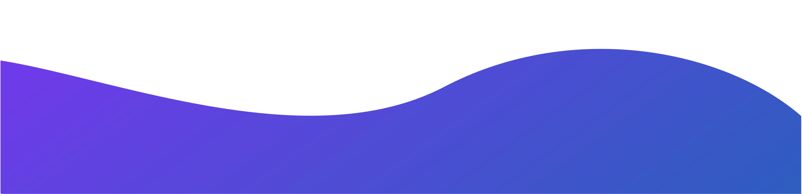

<h3 style=" font-family: 'Tahoma';"><b>Hi there  I’m Pranesh.</b></h3>

A passionate individual who loves building web applications.

<h3 align="center" style=" font-family: 'Tahoma';"><b>Tech Stack</b></h3>

<h3 align="center" style=" font-family: 'Tahoma';"><b>Languages</b></h3>

    
    
    
    
    

<h3 align="center" style=" font-family: 'Tahoma';"><b>Frameworks</b></h3>

    
    
    
    

    
    

<h3 align="center" style=" font-family: 'Tahoma';"><b>Databases</b></h3>

    
    

---

<h3 align="center" style=" font-family: 'Tahoma';"><b>GitHub Analytics</b></h3>

<h3 align="center" style=" font-family: 'Tahoma';"><b>Get In Touch</b></h3>

	
	
	
	
	

<!--
**Pranesh-vimal/Pranesh-vimal** is a ✨ _special_ ✨ repository because its `README.md` (this file) appears on your GitHub profile.

Here are some ideas to get you started:

- 🔭 I’m currently working on ...
- 🌱 I’m currently learning ...
- 👯 I’m looking to collaborate on ...
- 🤔 I’m looking for help with ...
- 💬 Ask me about ...
- 📫 How to reach me: ...
- 😄 Pronouns: ...
- ⚡ Fun fact: ...
-->
